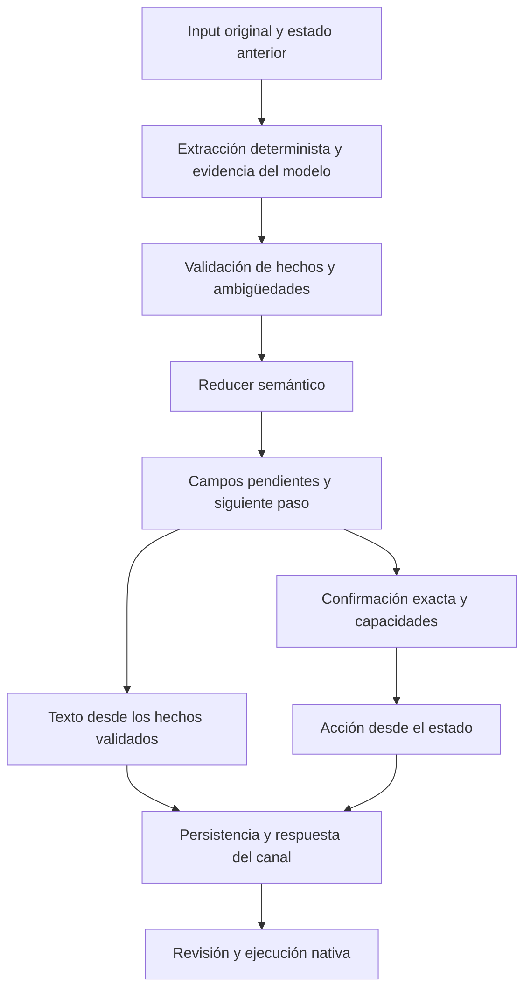

# Auditoría y reconstrucción semántica de BM

Fecha: 2026-09-16. Base: `6b6a63b`. Rama: `codex/backend-release-bm-semantic-audit-2026-09-15`.
Cambios locales, sin despliegue Netlify, Supabase o Sites. La validación final y sus límites están al final de este documento.

## 1. Diagnóstico

BM no tenía una única autoridad sobre el significado de una conversación. Clasificación, memoria, fallback, modelo, contrato de bloqueo, actionGate, normalización, canal y cliente podían reinterpretar el mismo dato. Una respuesta correcta del modelo podía terminar convertida en una respuesta incorrecta.

La base pasó los **19/19 comandos del product harness** antes de editar. Esto comprobaba los contratos que existían, no la equivalencia semántica. La auditoría independiente reproduce **seis falsos positivos** del evaluador original: texto con otra app/hora y ejecución inventada, `blocking_data` contradictorio, recurrencia alterada, permisos omitidos, frases absurdas con keywords y contradicciones en superficies secundarias. Ver `tools/bm_legacy_evaluator_audit.js` y el informe de evaluación.

### Flujo de la base

```text
input → extracción de memoria por canal → posible reescritura del input Meta
      → buildAgentContext → shouldUseAppLayer/classify
      → fallbackPlan + modelo con plan ejecutable, o modelo conversacional
      → resolveBlockingContract → actionGate → normalizePlan
      → conversationalMessage/localizePlan → normalización del canal
      → enlace → decodificación/defaults nativos → revisión o activación
```

| Capa | Causa observada | Fallo posible |
| --- | --- | --- |
| Input/canal | Meta convertía un follow-up de duración en una nueva orden de límite diario | Intención y duración distintas del input real |
| Clasificación | Keywords y rutas distintas para conversación/app | Respuesta corta desviada al saludo o al fallback incorrecto |
| Contexto | `userConversationText` concatenaba mensajes anteriores; `pending_blocking` y memoria eran fuentes independientes | Un dato corregido coexistía con el antiguo; primer match recuperaba el valor obsoleto |
| Tiempo | Defaults relativos, inferencia AM/PM y recurrencia por defecto | Duración convertida en hora; ventana o repetición inventada |
| Modelo | Schema de plan/acción sin slots, fuentes o revisión de confirmación | Texto y acción internamente plausibles pero con datos no dados |
| Prompt | Ejemplos de 22:00–07:00, 45 minutos o siete días sin elección del usuario | El sistema instruía algunas de las inferencias que luego intentaba prohibir |
| actionGate | Returns tempranos y listas de títulos de fallback | Acción elegida por heurística distinta del modelo; requisitos eludidos |
| Normalización | Reemplazo completo por título del fallback; borrado/clamp de campos | Modelo correcto → texto genérico; duración diferente entre capas |
| Presentación | Recortes, sustituciones lingüísticas y resumen propio por canal | Texto visible distinto del estado o pérdida de información esencial |
| Dispositivo | SMS usaba rutas directas y defaults; iOS tenía fallback ejecutable ante error de red | Acción prematura o ejecución sin el contrato del backend |
| Persistencia | Últimos 20 eventos, deduplicación por mensaje sin CAS de conversación | Pérdida por concurrencia, orden o expulsión del historial |

La matriz completa por WhatsApp Meta, WhatsApp Twilio/SMS, web, iOS y Android está en [BM_CHANNEL_AUDIT.md](BM_CHANNEL_AUDIT.md).

## 2. Por qué la conversación directa con Luna puede ser mejor

No se atribuye el problema al modelo base. Una llamada real de esta auditoría respondió con `model=gpt-5.6-luna`; la variable `OPENAI_MODEL` local no estaba configurada. Esto verifica la llamada local, no la configuración privada del despliegue. El ejemplo de variables aún decía `gpt-4.1-mini`; se corrigió.

La evaluación diferencial conserva entrada exacta, prompt, contexto, schema, salida cruda, acciones después del gate y texto normalizado. Una traza compara transformaciones de **la misma respuesta**, evitando atribuir a una capa la variación entre dos llamadas.

### Evidencia causal reproducida con el modelo activo

En `tmp/bm-semantic/live-differential.json`, conversación `ios_duration_correction`, repetición 1:

- Ante la corrección a 45 minutos, la salida cruda de Luna conservó Instagram y propuso `start_protection.minutes=45`.
- El actionGate retiró la acción y la normalización cambió el mensaje por un saludo genérico, con intención `general`.
- El turno previo «Just once» sufrió una pérdida de contexto semejante en la normalización.

Otra traza mantuvo correctamente una hora de duración y una corrección al mediodía en la salida cruda, mientras la salida procesada perdió el contexto. También hubo una propuesta cruda con `duration_days=14` transformada por el fallback a siete días: ninguna cifra estaba validada como elección del usuario.

El control directo recibió conversación normal; BM recibió contexto truncado/serializado, instrucciones adicionales, ejemplos y un schema de acciones. No son entradas equivalentes. El control directo también produjo sugerencias de controles del sistema y duraciones adicionales: **no hay evidencia de que Luna directa sea infalible**. La diferencia demostrada es que BM añadía fuentes de error propias y podía destruir una interpretación correcta.

## 3. Arquitectura implementada



`bm-semantic-state.js` mantiene versión, turno, revisión, intención, idioma, slots, correcciones, errores, estado conversacional, campos pendientes, pregunta esperada y fingerprint de propuesta/acción. Cada slot contiene valor, fuente, turno de origen, evidencia y confianza. Los valores derivados indican sus dependencias.

Slots: apps, categoría, momento, tipo de acción, modo duro, capacidad solicitada, inicio, fin, duración, recurrencia, horizonte de programación y confirmación. Se distinguen «ahora», minuto de reloj, minutos de duración, días semanales, fecha solicitada y caducidad del plan. Una revisión de bloqueos pasados no aporta duración ni autorización para un bloqueo futuro.

### Transiciones y reglas

1. Cada input modifica una copia del estado anterior; no se concatena el texto antiguo para volver a decidir qué dato gana. Una corrección sustituye el valor y elimina derivados incompatibles.
2. Cambiar intención cierra la autorización anterior. Cancelar vacía la propuesta; un «sí» posterior no la resucita. Consejo y petición de bloqueo tienen estados distintos.
3. La confirmación contiene el fingerprint de los hechos exactos. Cambiar apps, acción, tiempos, recurrencia u horizonte invalida la confirmación.
4. Antes de ejecutar una acción se comprueban datos, confirmación, presencia, permisos y selección exacta. Si la propuesta está completa y confirmada pero falta un heartbeat reciente, el canal puede transportar únicamente una acción marcada como revisión; Blankmind vuelve a comprobar presencia, permisos y selección antes de aplicar. «Ya tengo la app» no demuestra presencia ni permisos. Un selector sin parámetros es setup, no una orden de bloqueo.
5. Texto y acciones se generan desde el mismo estado. La ruta semántica evita las reescrituras legacy; todos los canales reciben los mismos hechos. El modelo no puede autorizar, inventar apps seleccionadas ni convertir una respuesta libre en una acción.

### Extracción del modelo

`bm-semantic-extraction.js` usa un schema pequeño de campos y evidencia literal del turno actual. No contiene acciones, CTAs, bullets ni confirmación. El validador comprueba tipos, rangos, origen y significado de átomos temporales; rechaza alternativas ambiguas, valores inventados y evidencia vieja/negada. Una extracción errónea no sustituye un dato determinista válido.

Esta separación mejora la seguridad y permite medir los rechazos. **No convierte el parser en un intérprete universal**: la autorización de una intención nueva sigue siendo conservadora, y las formulaciones no soportadas necesitan aclaración. El modelo no debe recuperar capacidad de ejecución mediante un fallback.

La prueba activa detectó también un defecto del schema inicial: `value_json` pedía JSON dentro de una cadena. Dos respuestas devolvieron `mornings` como cadena ordinaria y fallaron al intentar decodificarla otra vez. Se sustituyó por variantes de campo con `value` tipado: cadena, número, booleano, array u objeto según el slot. El payload se decodifica una sola vez y pasa después por el validador semántico. La API real de Luna aceptó el schema nuevo; los dos fallos previos se conservan, aunque el fallback mantuviera correctamente el estado.

### Persistencia y superficies

WhatsApp/SMS conservan el estado canónico; web e iOS lo devuelven en el turno siguiente. La migración `015_assistant_semantic_conversations.sql` y el almacén correspondiente añaden lectura durable y escritura con comparación de versión. El modo requerido y la migración deben estar validados antes de una release; el historial de eventos por sí solo no demuestra resistencia a conversaciones concurrentes.

El CAS evita sobrescribir una versión que cambió durante una llamada. No demuestra orden cronológico de entrega entre proveedores: mensajes distintos que llegan fuera de orden siguen necesitando una política de orden/reconciliación y pruebas reales. Los mocks verifican conflictos y reintentos, no reemplazan esas pruebas.

Los enlaces se comparten entre Meta y SMS, abren revisión y preservan los valores. iOS conserva el estado con TTL de dos horas, evita recortar el texto canónico y falla con cero acciones cuando el backend no responde. Android no tiene un chat BM equivalente en este repositorio: las pruebas con `channel=android` validan el contrato backend, no una pantalla nativa inexistente.

## 4. Límites reales del contrato nativo

No se transforman silenciosamente limitaciones de la app en decisiones del usuario:

- Un inicio programado con fecha única no está representado fielmente por el protocolo actual de horario semanal más caducidad. Queda sin ejecución y con explicación; no se transforma «mañana» en una regla que empieza hoy.
- Las apps existentes convierten `duration_days=null` en siete días. La nueva ruta pide explícitamente el horizonte de 1–14 días para programaciones recurrentes. No promete recurrencia indefinida.
- Los bloqueos inmediatos/límites usan el rango nativo de 5–240 minutos. Fuera de rango se pide aclaración; no se cambia el número con un clamp.
- Nombrar Instagram no demuestra que la selección privada actual sea Instagram. Se necesita coincidencia verificada con selección/modo o revisión de selección en la app.

Ampliar esas capacidades requiere contrato/versionado y pruebas nativas, no ampliar el prompt.

La ruta canónica conserva el modo duro explícito para acciones que realmente lo soportan y lo muestra en la confirmación. Las combinaciones no representables necesitan aclaración. Filtro adulto, allow-only y restricciones de uso laboral/estudio se reconocen como capacidades distintas: este candidato informa del límite y devuelve cero acciones. No se degrada una lista de excepciones a un bloqueo ordinario. Los controles legacy de pausa/cambio de modo tampoco pueden generar mutaciones desde la salida libre del modelo; esta restricción debe revisarse como limitación funcional de la candidata antes de una release, no ocultarse como mejora de calidad.

## 5. Evaluación y criterios de release

Ver [BM_EVALUATION.md](BM_EVALUATION.md) para comandos, datasets, replay, mutaciones, revisiones de texto y evaluación diferencial.

La parte dura evalúa estado completo, transiciones, evidencia, intención, slots, siguiente paso, acciones, confirmación, presencia/permisos y contradicciones visibles. Un fallo grave bloquea el resultado; no se compensa con una media de tono o keywords. La naturalidad y utilidad se evalúan por separado.

La ausencia de una contradicción por regex **no prueba equivalencia lingüística**. El evaluador exige revisión independiente del significado de todas las superficies, vinculada mediante hashes a la salida y la expectativa exactas. Una salida nueva queda `unverified`, nunca aprobada por contener palabras esperadas. El conjunto reservado inicial se conserva con sus fallos y deja de ser oculto una vez usado para corregir. Un nuevo holdout debe congelarse antes de evaluarlo.

Las revisiones de esta tarea son realizadas por agentes distintos del implementador; no se presentan como revisión humana ni como un juez lingüístico infalible. Los hashes vinculan una revisión concreta a una salida concreta y evitan reutilizarla tras una mutación. La naturalidad sigue requiriendo valoración de producto con conversaciones más amplias.

Release exige conjuntamente:

1. Cero errores duros y cero turnos sin revisar en desarrollo, corpus anonimizado, holdout nuevo y repeticiones con modelo activo.
2. Mutaciones de apps, horas, duración, recurrencia, confirmación y texto/acción detectadas; ninguna salida absurda aprobada automáticamente.
3. Gates existentes ejecutados, discrepancias legacy clasificadas y regresiones reales corregidas; product harness con baseline y alcance válido.
4. Migración/CAS verificados con concurrencia real, capacidades nativas compatibles y build de los clientes modificados.
5. Smoke final físico en WhatsApp/SMS y app, seguido de verificación de ejecución. El batch no usa WhatsApp ni SMS para generar mensajes masivos.

### Qué significa ahora el gate

`bai_release_gate.js` ejecuta los evaluadores antiguos sin cambiar sus fixtures/asserts y conserva sus salidas en `legacy_diagnostics`. Sus scores ya no autorizan una release: seis contraejemplos reproducibles demostraron que no verifican significado. Los checks automatizados nuevos comprueban reducer, extracción hostil, oracle, persistencia, enlaces, caché SMS, replay revisado y transporte. `automated_checks_passed` describe exclusivamente esos checks; `production_release_verified` queda explícitamente en `false`.

Esta sustitución **no exime todos los fallos anteriores**. La revisión individual de 52 fallos iniciales encontró 13 expectativas obsoletas sin defecto duro demostrado en ese turno, 28 casos que mezclaban expectativa obsoleta y defecto real, siete defectos reales y cuatro casos de calidad pendientes. [BM_LEGACY_GATE_ADJUDICATION.md](BM_LEGACY_GATE_ADJUDICATION.md) conserva los casos y su evidencia anterior a las correcciones. Los fallos requieren nueva evidencia de cierre; no se suman a una media ni se convierten en aprobados al moverlos a diagnóstico. Un harness verde por sí solo sigue siendo insuficiente para publicar.

### Datos observados y privacidad

Se consultaron 80 eventos existentes mediante lectura autenticada, sin modificar producción ni mostrar credenciales. La extracción produjo 17 snapshots solapados, 59 ocurrencias de intercambio y 14 pares de texto únicos. El corpus minimizado elimina identificadores, timestamps y enlaces. La autoría humana y el número de conversaciones distintas no se pueden verificar: se etiqueta **texto observado en producción**, no 17 conversaciones humanas independientes.

`tools/datasets/bm_production_observed_anonymized.json` conserva esos pares; un replay independiente usa inputs exactos y expectativas escritas antes de ejecutarlo. Su primera ejecución local y con modelo activo encontró seis fallos duros en siete turnos: las peticiones declarativas de reducir scroll y el plural «mornings» escapaban a la ruta canónica. Los resultados iniciales permanecen como evidencia, aunque se corrija la implementación.

## 6. Evidencia final

Los informes extensos están en `tmp/bm-semantic/` y `tmp/bm-audit/`; [BM_EVALUATION_EVIDENCE.json](BM_EVALUATION_EVIDENCE.json) conserva cifras, hashes y ejemplos seleccionados. No se mezclan versiones ni se borran los informes fallidos.

| Evidencia | Resultado y alcance |
| --- | --- |
| Product harness | Base original 19/19; validación final ampliada **25/25**, cero reparaciones y cero violaciones de alcance, contra la baseline creada antes de editar. Informe `tmp/bm-audit/final-harness.json`. |
| Invariantes y transporte | **83/83** checks del core; extracción hostil/valores tipados, smoke integrado de 46 llamadas, memoria, presencia, CAS simulado, enlaces y caché SMS incluidos en los gates. No son 83 conversaciones humanas. |
| Mutaciones del oracle | **42 errores deliberados impedidos de aprobarse**: 40 rechazos duros y dos revisiones de texto invalidadas. Incluye modo duro, nombre de modo y cifras observadas frente a duración futura. |
| Evaluador anterior | Acepta **6/6** planes deliberadamente incorrectos. Su última ejecución original conserva **61/114 discrepancias**; golden 25/25 y amplio 125/125 fueron generación de escenarios (`0/0` calidad), no evaluación del modelo. Adjudicación histórica y diferencias finales en documento separado. |
| Batch canónico | **960/960** turnos revisados: seis guiones repetidos 40 veces, 240 ejecuciones con concurrencia 12. Mide estabilidad y ejecución del batch, no 240 situaciones distintas. |
| Holdout independiente | V4: **11/11** turnos de cinco conversaciones, correctos desde su primera ejecución y revisados por otro agente. V3 reparado: 12/12; sus tres fallos iniciales permanecen. V1/V2 también conservan resultados originales y adjudicación. |
| Corpus observado | Replay local **7/7**. Se trata de tres extractos construidos a partir del texto observado, con contexto de prueba explícito; no se presenta como reconstrucción íntegra de conversaciones humanas verificadas. |
| Luna activo, schema tipado | **56/56** turnos: 24 de desarrollo (dos guiones × tres repeticiones), 21 del corpus observado (siete turnos × tres repeticiones) y 11 del v4 en una pasada activa adicional. Todas las respuestas acreditan `gpt-5.6-luna:semantic`; cero errores de fallback y cero turnos sin revisar. Informes `typed-final-live-24.json`, `typed-final-production-live-21.json` y `typed-final-heldout-v4-live-11.json`. |
| Clientes | Web: build de 18 rutas y lint del archivo pasan. Lint general encuentra artefactos generados preexistentes. iOS: revisión estática, **sin compilación ni prueba física**. Android: contrato backend, sin chat nativo equivalente. |

Las repeticiones activas y sus versiones de schema se detallan por separado en el informe de evaluación. El ensayo anterior al schema tipado aprobó 24 turnos de desarrollo y falló dos de 21 turnos observados por la segunda decodificación JSON. Ese fallo no se convirtió en aprobación por conservar un fallback correcto; el informe posterior verifica la corrección sobre las mismas expectativas.

### Qué queda abierto

**Esta rama no está aprobada para producción.** Quedan la validación real de la migración/CAS y del orden de mensajes, compilación iOS y ejecución física de permisos/selección/revisión/bloqueo. También quedan límites funcionales expresos (fechas únicas, combinaciones no soportadas y controles legacy), objetivos de sueño incompletamente modelados y revisión de utilidad/naturalidad del consejo y la proactividad. La adjudicación no declara cerrados en bloque los 35 defectos observados en el snapshot anterior ni los cuatro casos de juicio pendientes.

La mejora demostrada es concreta: el estado conserva apps y tiempos, las correcciones sustituyen hechos e invalidan la confirmación, las acciones salen de ese estado y el evaluador descubre errores que antes aprobaba. Esa evidencia no autoriza afirmar que BM comprende cualquier formulación ni que está listo para publicar.
